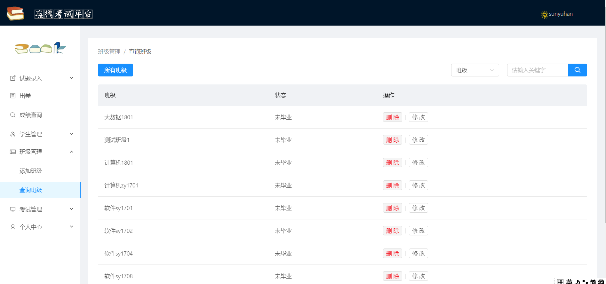
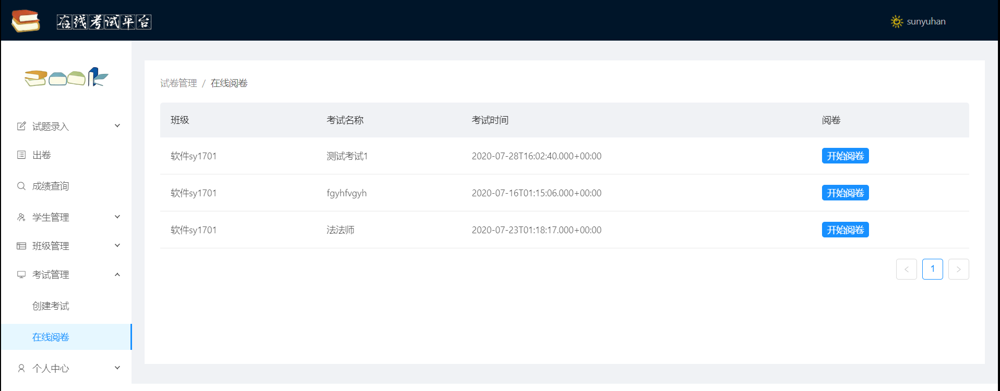
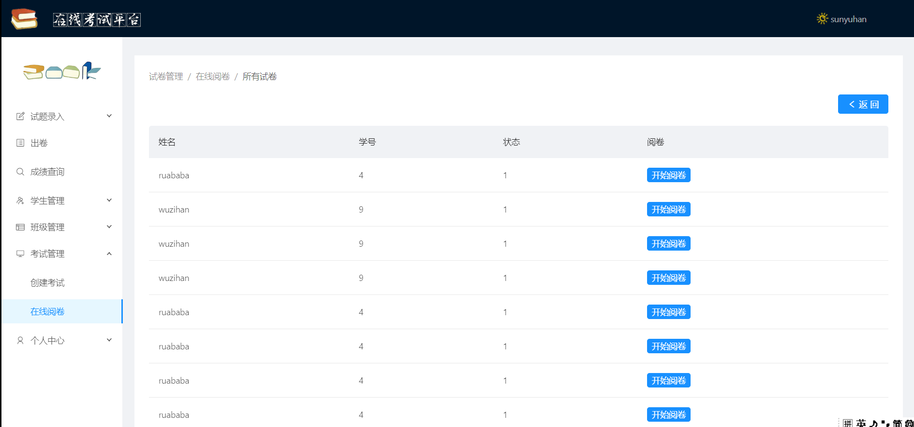

# -C212倾情奉献——在线考试平台    

#### 管理端+前端+后端    三合一大礼包，没有更全只有更全！！！
#### 项目采用React + ANTD + SpringCloud
#### 开发环境使用Webpack搭建
---
### 目录
- [功能板块-教师](#功能板块-教师)

- [功能板块-学生](#功能板块-学生)

- [管理端页面](#管理端主要页面展示)

- [学生端页面](#学生端页面)

- [项目搭建](#项目搭建)

- [了解更多](#了解更多)

***
### 功能板块-教师
1.登录

2.主页面
- 头部菜单，左侧菜单，中间内容，包含各种功能的引导

3.试题录入
- 题目类型
    - 单选题
    - 多选题
    - 填空题
    - 简答题

- 初中、高中
    - 数学
    - 语文
    - 英语

4.出卷
- 根据题库里的试题进行出卷

5.成绩查询
- 老师所管辖的所有学生的成绩

6.学生管理，班级管理
- 增删改查

7.考试管理
- 阅卷
    - 由电脑自动批改选择题、多选题，教师批改填空题和简答题
- 创建考试
    - 由老师创建考试，分配给指定学生

8.个人中心
- 修改密码

---
### 功能板块-学生
1.登录

2.学生主页
- 左侧菜单，头部菜单，中间是一个轮播图

3.考试页面
- 学生考试的页面，包含头部信息栏，考试信息，和下方的题目和回答板块，由后台判断是否有考试

4.个人中心
- 修改密码
---

### 管理端主要页面展示
**1.登录页面**


**2.管理端主页**


**3.试题录入**


**4.出卷**


**5.学生管理**


**6.班级管理**


**7.阅卷页面**



**8.创建考试**


**9.修改密码**


---

### 学生端页面

**学生主页**


**考试页面**


---

## 项目搭建

1.下载或克隆项目到本地 

2.安装相关包
 ``` 
 npm install
 ```

3.启动项目
```
npm start 
```

4.其它命令
```
打包: npm run build
```
---

### 了解更多

- <font color="#FFD700">~~没有更多~~</font>


